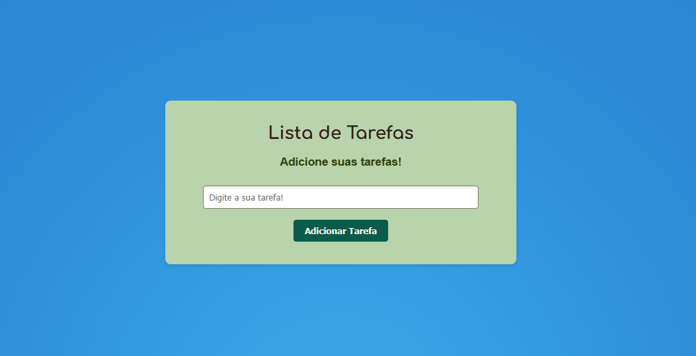

<h1 align="center"> Lista de Tarefas e Número Secreto! </h1>

Projeto com duas funções: gerenciador de tarefas e jogo do número secreto!

  <a href="#-tecnologias">Tecnologias</a>&nbsp;&nbsp;&nbsp;|&nbsp;&nbsp;&nbsp;
  <a href="#-projeto">Projeto</a>&nbsp;&nbsp;&nbsp;|&nbsp;&nbsp;&nbsp;
  

  

 

  
  

## 🚀 Tecnologias

Esse projeto foi desenvolvido com as seguintes tecnologias:

- HTML e CSS
- JavaScript
- Git e Github

## 💻 Projeto

Desenvolvi um projeto web com duas funcionalidades distintas: uma lista de tarefas interativa, com recursos de adicionar, editar e remover itens, e um jogo do número secreto que desafia o usuário a adivinhar o valor correto.

## 🔖 Licença

Esse projeto está sob a licença MIT....